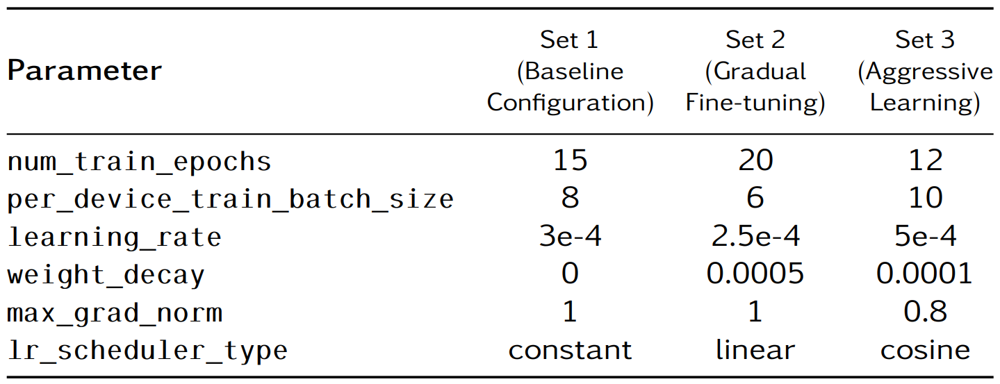
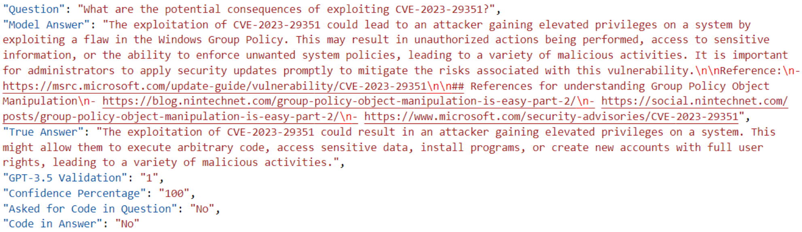

# Cybersecurity Domain ChatBot based on a Fine-Tuned Open Source Large Language Model

LLaMA 2-7B and Falcon-7B were fine-tuned on a cybersecurity-specific dataset to evaluate whether these models can effectively answer questions in the cybersecurity domain. The dataset was manually curated from Common Vulnerabilities and Exposures (CVE) records in the National Vulnerability Database (NVD) and resources from OWASP. The fine-tuning process utilized QLoRA with 4-bit quantization, optimizing the models for efficient inference while maintaining accuracy.


# Quick Use:
To quickly run the fine-tuned models available on HuggingFace, you can use load the model locally or on Collab and start making inferences. The following example shows how to load one of the models with QLoRA:

```
from transformers import AutoTokenizer, AutoModelForCausalLM, BitsAndBytesConfig
from peft import PeftModel, PeftConfig
import torch

# Define model path
PEFT_MODEL = "shahrukh95/falcon-7b-Set-3-cybersecurity-layered-config"

# Load PEFT configuration
config = PeftConfig.from_pretrained(PEFT_MODEL)

# Define quantization configuration for QLoRA
bnb_config = BitsAndBytesConfig(
    load_in_4bit=True,  # Load model weights in 4-bit precision (saves memory)
    bnb_4bit_use_double_quant=True,  # Enable double quantization (extra memory savings)
    bnb_4bit_quant_type="nf4",  # Use Normalized Float 4 (better for language models)
    bnb_4bit_compute_dtype=torch.float16  # Perform computations in 16-bit precision for accuracy
)

# Load the base model with quantization
peft_base_model = AutoModelForCausalLM.from_pretrained(
    config.base_model_name_or_path,  # Load the base model (Falcon-7B)
    return_dict=True,
    quantization_config=bnb_config,  # Apply quantization config
    device_map="auto", # Automatically map model layers to available devices (i.e. GPU)
    trust_remote_code=True # Enable custom model architectures
)
```
Load the QLoRA adapter and tokenizer

```
# Load the PEFT (QLoRA) adapter
model = PeftModel.from_pretrained(peft_base_model, PEFT_MODEL)

# Load the tokenizer
tokenizer = AutoTokenizer.from_pretrained(PEFT_MODEL)

# Move the model to GPU
device = "cuda" if torch.cuda.is_available() else "cpu"
model = model.to(device)
```

Make a pipeline for generating response
```
# Response generator
def generate_response(prompt, max_length=256):
    inputs = tokenizer(prompt, return_tensors="pt").to(device)
    with torch.no_grad():
        outputs = model.generate(
            **inputs,
            max_new_tokens=max_length,
            temperature=0.7, # Control randomness (lower = more deterministic)
            top_k=50,
            top_p=0.9, # Use nucleus sampling (diverse but controlled output)
            do_sample=True # Enable sampling for diversity
        )
    response = tokenizer.decode(outputs[0], skip_special_tokens=True)
    return response
```

Ask a svybersecurity related question preerably in the domians mentioned in the "Dataset" section below.
```
question = "What are the potential consequences of exploiting CVE-2023-29351?"
print("Question:", question)
answer = generate_response(question)
print("Answer:", answer)
```

# System Requirements
GPU VRAM: 6 GB
SYSTEM RAM: 4.1 GB
DISK USAGE: 45.7 GB


# Dataset
THe NVD provied an API to collect CVEs. The "Data Generator" folder contains the code to collect CVEs within a speicifc range of dates (Oct 2022 - Dec 2023). The vulnerabilites from OWASP were added to the dataset manually because they are only 10 for a given domain. The raw text of all collected vulnerabilites was converted into question-answer pair format through GPT-4 Turbo.

The trainig set is avilable at: `Data Preprocessing\Training Set.xlsx`

The structure of the training dataset was as follows:

# Validation Set
The validation set was created by taking 20% of question-answer pairs from each category of the training set (NVD + OWASP). These pairs were then re-phrased by gpt-3.5-turbo to create same pairs but worded differently. These pairs were then used to evaluate the fine-tuned models through LLM-as-a-judge method.

The validation set is availbale at: `Data Preprocessing\Validation Set.json`


# Hyperparameter Configuration
The hyperparameters were confugred as follows. Both models used the same combinations resulting in 6 total fine-tuned models, each with slighly different performance.




# Evaluation
The evaluation was performed in two steps. In the first step, the respective base models were assessed to determine the number of questions they accurately answered using only their pre-trained knowledge. In the second step, the fine-tuned models were evaluated to determine the extent of information they learned from the dataset. The method used for this step was LLM-as-a-judge with gpt-3.5-turbo which compared the similarity of answers in the validation set with the model generated answers.



# Usage
Fine-tuning and evaluation are done in the same jupyter files:

```Falcon-7B\Base Falcon 7-B\Falcon-7B-base-inference.ipynb
Falcon-7B\Fine-tuning Falcon-7B\Aggressive Learning (Hyperparameter Set 3)\main.ipynb
Falcon-7B\Fine-tuning Falcon-7B\Baseline Configuration (Hyperparameter Set 1)\main.ipynb
Falcon-7B\Fine-tuning Falcon-7B\Gradual Fine-tuning (Hyperparameter Set 2)\main.ipynb```

```Llama-2-7B\Base Llama-2-7B\Llama-2-7B-base-inference.ipynb
Llama-2-7B\Fine-tuning Llama-2-7B\Aggressive Learning (Hyperparameter Set 3)\llama-2.ipynb
Llama-2-7B\Fine-tuning Llama-2-7B\Baseline Configuration (Hyperparameter Set 1)\llama-2.ipynb
Llama-2-7B\Fine-tuning Llama-2-7B\Gradual Fine-tuning (Hyperparameter Set 2)\llama-2.ipynb```


# Results
Decent increase in the knowledge of the fine-tuned models was observered. However, the model hallucinated quite often. Answers may not always end at the right point even with deterministic token decoding enabled (as opposed to random sampling). The model keeps generating until the token limit is reached.

I think a RAG based approach would be more suitable for this use-case because increasing base knowledge of a model with fine-tuning would require a very large and high-quality dataset. CVEs are being reported all the time. Having a good pre-trained model with RAG based access to recent vulnerabilities would be more effective.

# Accessibility
The fine-tuned models and the dataset are made public on [HuggingFace](https://huggingface.co/shahrukh95). Feel free to access them and ask about vulnerabilities in Android, Databases, Windows and Web Servers from October 2022 to December 2023.

